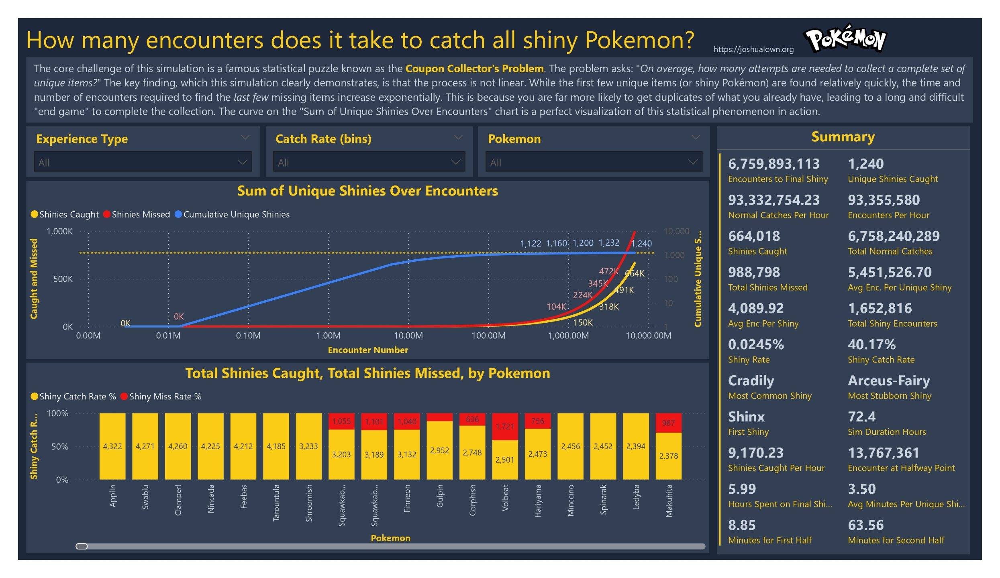

# Shiny Pokémon Encounter Simulator



A command-line Python application that simulates the long and arduous process of hunting for a complete shiny Pokédex. This project was designed not only to run the simulation but also to generate a rich dataset for analyzing the statistical realities of collecting rare items with weighted probabilities—a variation of the **"Coupon Collector's Problem."**

After a continuous runtime of **72.4 hours**, the simulation successfully completed its goal of catching one of every unique shiny Pokémon, generating a dataset of over 1.6 million shiny encounters.

### **Read the Full Story & See the Interactive Report**

For a detailed breakdown of the project's journey, the key insights from the data, and the story behind the numbers, check out the full blog post:

**[I Simulated 6.7 Billion Pokémon Encounters to Quantify Your Suffering](https://joshualown.org/2025/10/05/i-simulated-6-7-billion-pokemon-encounters-to-quantify-your-suffering/)**

---

## Final Results at a Glance

- **Total Encounters Simulated:** 6,759,893,113
- **Total Simulation Time:** 72.4 Hours
- **Total Shiny Encounters:** 1,652,816
- **Total Shinies Caught:** 664,018
- **Total Shinies Missed:** 988,798
- **Final Unique Shiny Caught:** Arceus-Fairy


---

## Key Features

- **Data-Driven**: All Pokémon stats are sourced from external `.csv` files or generated via the PokéAPI.
- **Weighted Encounters**: Pokémon spawn rates are weighted based on their in-game "Experience Type" (e.g., Slow, Fast), ensuring a realistic distribution of encounters.
- **Catch Mechanics**: Each shiny encounter triggers a catch attempt based on the Pokémon's specific catch rate, adding another layer of probability.
- **Robust Checkpointing**: The simulation automatically saves its state to a `checkpoint.json` file, allowing it to resume seamlessly after interruptions.
- **Detailed Data Logging**: Every single shiny encounter is recorded in `shiny_analysis_log.csv`, designed for in-depth analysis in tools like Power BI.
- **Optimized for Performance**: The main loop is highly optimized to ensure the simulation can run for billions of encounters efficiently.
- **Live Progress Tracking**: A clean progress bar in the terminal provides real-time updates.


---

## How It Works

The project is split into several Python scripts:

1.  **`pokeapi.py` (Primary Data Generation)**: This is a comprehensive script that connects to the PokéAPI, fetches detailed data for every Pokémon (stats, types, Pokédex entries, evolution info, etc.), and saves it into a clean `pokedex_full_dataset.csv`. This is the recommended source for the most complete data.

2.  **`makejsonlist.py` (Data Preparation)**: This is a legacy utility that reads from a raw `Stats.csv` file and generates the `pokedex.json` file used by the simulator.

3.  **`shiny.py` (The Simulator)**:
    - On startup, it looks for `checkpoint.json` to resume a previous run.
    - If no checkpoint is found, it starts a new simulation.
    - The main loop runs until a shiny version of every Pokémon has been successfully caught, simulating encounters, shiny checks, and catch attempts.

## How to Run

1.  **Install Dependencies**: Ensure you have the required Python libraries.

    ```bash
    pip install pandas requests tqdm
    ```

2.  **(Optional but Recommended) Generate Full Pokémon Dataset**:

    ```bash
    python pokeapi.py
    ```

3.  **Run the Simulation**:

    ```bash
    python shiny.py
    ```

    - To start a fresh simulation, delete the `checkpoint.json` file.

4.  **Stop the Simulation**: To stop early, press **`Ctrl+C`**. The script will save a final checkpoint and generate the report files with the progress so far.

---


## Generated Files

The scripts will generate the following files:

- **`pokedex_full_dataset.csv`**: The complete, rich dataset of all Pokémon stats and lore from the PokéAPI.
- **`shiny_analysis_log_{timestamp}.csv`**: The most important file for analysis. Contains a detailed log of every shiny encounter from the simulation.
- **`shiny_encounters_{timestamp}.csv`**: A summary of how many times each unique shiny species was _caught_.
- **`normal_encounters_{timestamp}.csv`**: A summary of how many times each normal Pokémon was encountered.
- **`checkpoint.json`**: The file containing the saved state of the simulation.

---

## Thank You


Thank you for checking out this project! It was a passion-fueled journey into data simulation, analysis, and storytelling. I hope you found the results as fascinating as I did.

For more projects, simulations, and data-driven descents into madness, feel free to visit my website.

**[joshualown.org](https://joshualown.org)**
